# Grablings ModTools

## Getting started

Clone this project or download it as a zipfile.

The project is made in **Unity 6000.3.5f2**. Other versions of Unity might not work. \
Download it from the Unity Hub or from the Unity download archive: \
https://unity.com/releases/editor/whats-new/6000.3.5f2#installs

Make sure the **Android build module** is installed. \
If you're on macOS or Linux, also install the **Windows Standalone module**. \
Currently standalone builds are unused, but they are built regardless to future-proof mods.

## Creating a map

Once the project is opened in Unity you can find an example scene under `Assets/Grablings/Scenes/Sample/SampleScene.unity`. \
This scene can be used as a reference, or as a base to create a new map on top.

The rest of this guide will show how to set up a map from scratch.

Start by creating a new scene.

A Grablings paint and seek map has the following requirements:

- Lighting should be baked with baked indirect lighting
- A light probe group should be set up.
- No cameras in the scene.

#### Lighting

To set up baked lighting go to `Window/Rendering/Lighting`. \
In the field **Lighting Settings Asset** select `GrablingsLightingSettings`, found at `Assets/GrablingsLightingSettings.lighting`. \
A new scene starts out with Unity's default lighting settings, so this has to be done for every map.

- Before baking, make sure that all objects are set to static.
- Make sure all lights are set to baked mode.
- Make sure lightprobes are added to the scene. 

Lighting can be baked by pressing the generate lighting button.

<br>
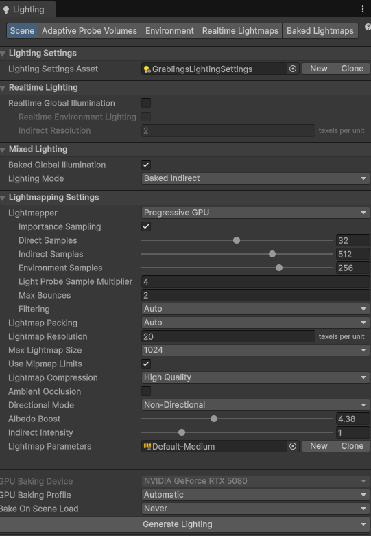
<br>
<br>

#### SpawnPoint
By default players will spawn in a map at (0,0,0). \
To spawn players at another place the spawnpoint prefab found under `Assets/Grablings/Prefabs/Spawnpoint` can be used. \
Place the spawnpoint at the point the player's feet should be.


#### SeekerBlockers
Some maps require blockers that seekers cannot pass in order for hiders to hide themselves. \
For example seekers cannot pass the ropes in the museum map. \
To set this up there is a blocker prefab that can be found under `Assets/Grablings/Prefabs/SeekerBlocker`.


## Building a map

Find and select the scene in the project browser. \
At the bottom of the inspector window open the **AssetBundle** dropdown and add a new unique AssetBundle name for the map.

<br>
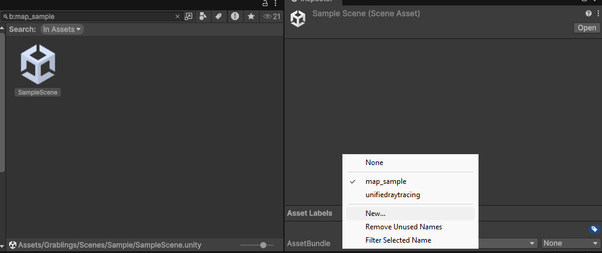
<br>
<br>

Open the Grablings mod tool from the top bar `Grablings/ModTools`. \
If you've correctly tagged your scene with an AssetBundle name it should show up in the list of AssetBundles to build. \
Check the checkbox of the maps you want to build and click the **build assetbundles** button.

<br>
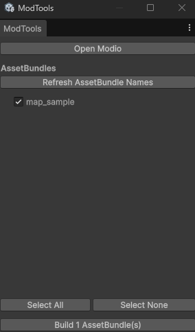
<br>
<br>

If the build was successful, an explorer window should pop up with 2 folders named Android and Standalone.

## Testing

To test your map, find the AssetBundle in the Android folder and copy it to the following path on a Meta Quest headset: \
`/sdcard/Android/data/com.TriangleLabs.Grablings/files/paintandseek/maps`.

This can be done via ADB or via SideQuest.

#### SideQuest
Connect the headset over USB, allow the USB debugging prompt in the headset. \
In SideQuest click on the folder icon. \
Now navigate to `/sdcard/Android/data/com.TriangleLabs.Grablings/files/paintandseek/maps`. \
Drag and drop your bundle file to upload it to the headset.

<br>
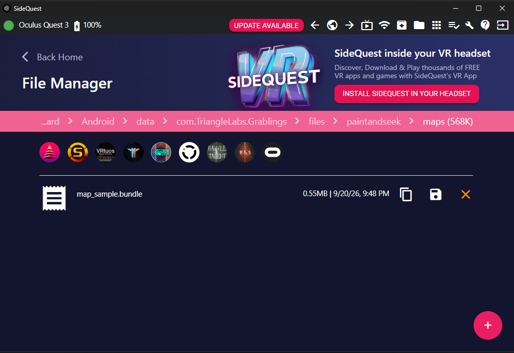
<br>
<br>

#### ADB
Connect the headset over USB, allow the USB debugging prompt in the headset, then run:

```
adb devices
adb shell mkdir -p /sdcard/Android/data/com.TriangleLabs.Grablings/files/paintandseek/maps
adb push map_sample.bundle /sdcard/Android/data/com.TriangleLabs.Grablings/files/paintandseek/maps/
```

Replace `map_sample.bundle` with your own bundle, taken from the **Android** folder. \
Only the .bundle file is needed, the .manifest files next to it can be ignored.

Check that it arrived with:

```
adb shell ls /sdcard/Android/data/com.TriangleLabs.Grablings/files/paintandseek/maps
```

#### Testing in the headset

Once the bundle file is on the device, boot the game.
- Start a private lobby. 
- The mod browser should now show a "local" tab. 
- From here the mod can be voted on. 

> ⚠️ **Warning:** players who do not have the local mod installed will be kicked from the game once the map loads. 

## Upload to mod.io

To upload a mod to mod.io, first create 2 zip archives of the AssetBundles in the `Standalone` and `Android` folders. \
Each zip archive should only contain one AssetBundle. \
Name these something obvious like `modname_standalone.zip` and `modname_android.zip`.


Go to https://mod.io/g/grablings and log in or create an account.

Once logged in there is an add mod button in the top right corner.


<br>
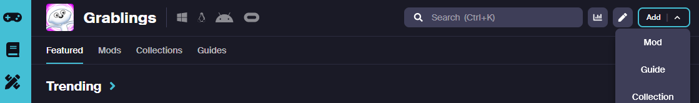
<br>
<br>

Go through the steps. \
Fill in a mod name, summary and mod listing image.

<br>
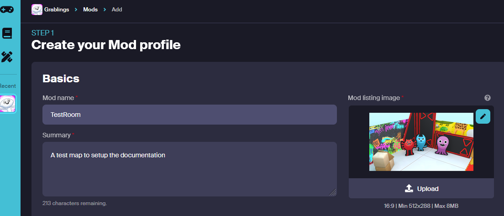
<br>
<br>

Under tag selection, select the game mode the map is made for. \
Currently only `paintandseek` is available.

<br>
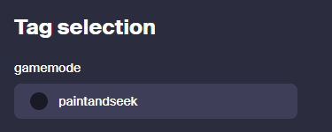
<br>
<br>


Click the create mod button to go to the next step.

<br>
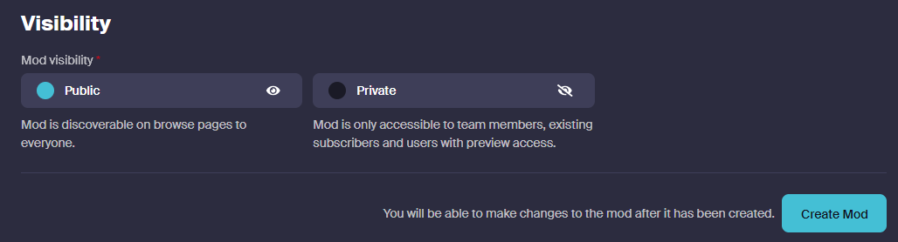
<br>
<br>

Now add screenshots and images that should appear on the mod page. \
Continue to the next step by clicking `Save & next`.

<br>
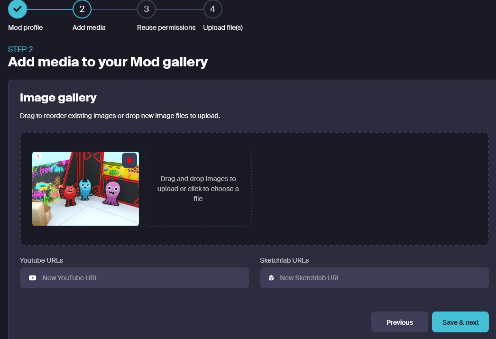
<br>
<br>

Set up your preferred reuse permissions and go to the next step by clicking `Save & next`.

<br>
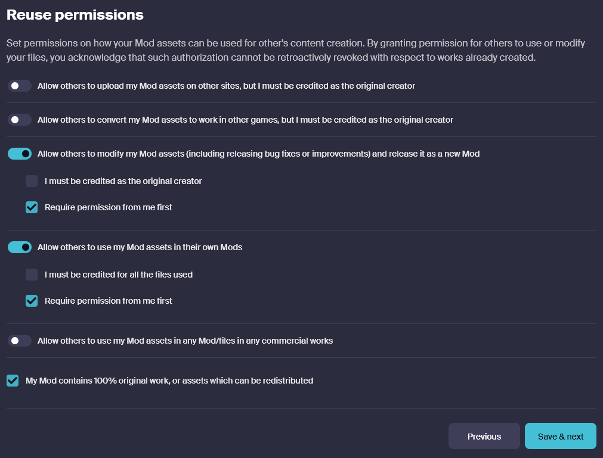
<br>
<br>

Now upload the Android zip archive by dragging and dropping it into the window. \
Select both the Android and Oculus platforms, and fill in a version number.

Click `Upload & keep as draft`.

<br>
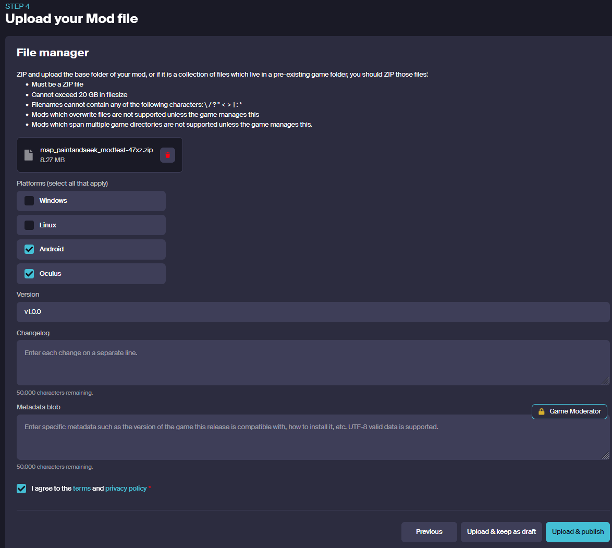
<br>
<br>


Now the second zip file can be uploaded by clicking `Add a new file`. \
Do the same as for the Android version, but now select `Windows`.

<br>
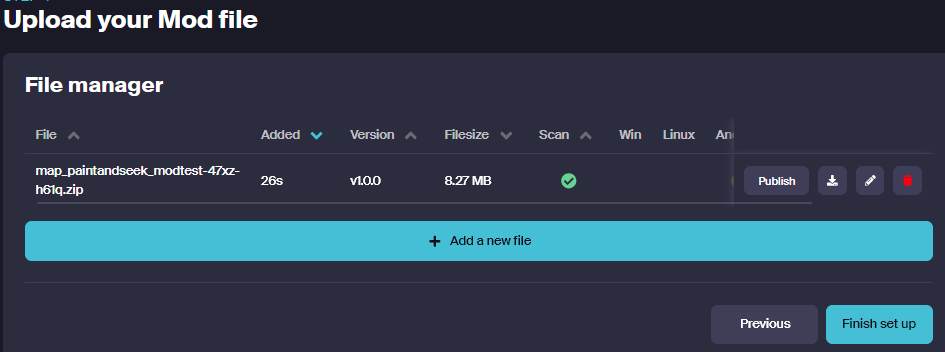
<br>
<br>

<br>
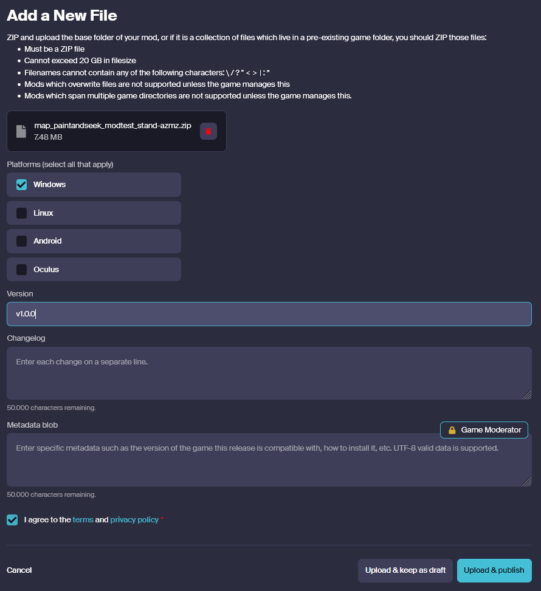
<br>
<br>

Click `Upload & publish` to publish the mod.

> ℹ️ **Note:** all mods will be reviewed by a Grablings team member before being made public.


